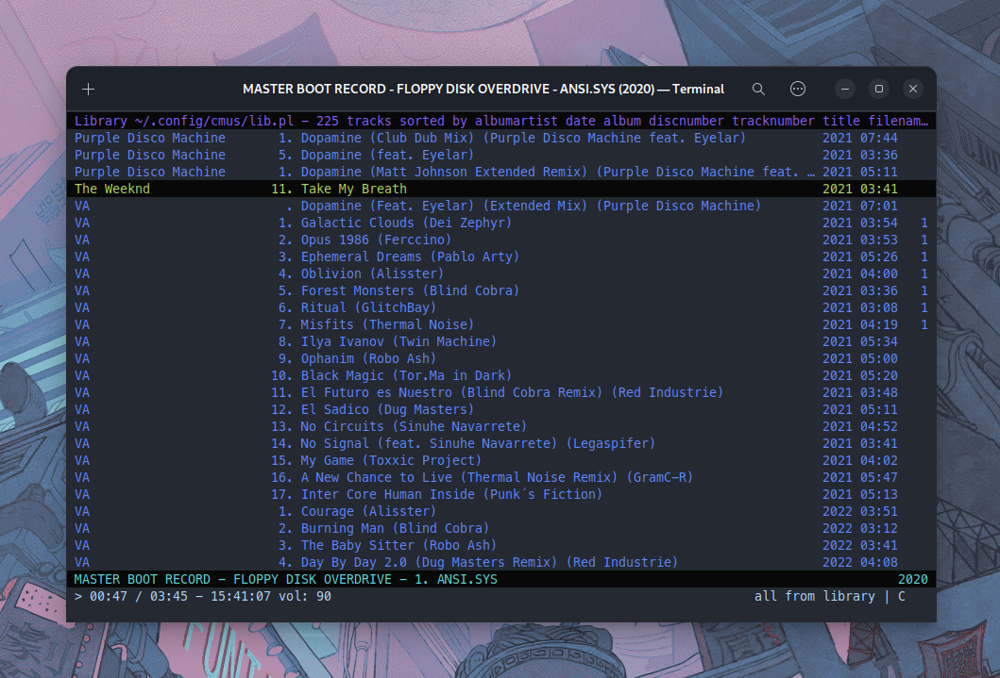

# Tokyo Night Theme for cmus

## Use This Theme

- Make sure to put the `tokyo-night.theme` file into your `~/.config/cmus` folder
- Run `:colorscheme tokyo-night` inside cmus

## Credits

Inspired by the Tokyo Night VS Code theme: https://github.com/enkia/tokyo-night-vscode-theme